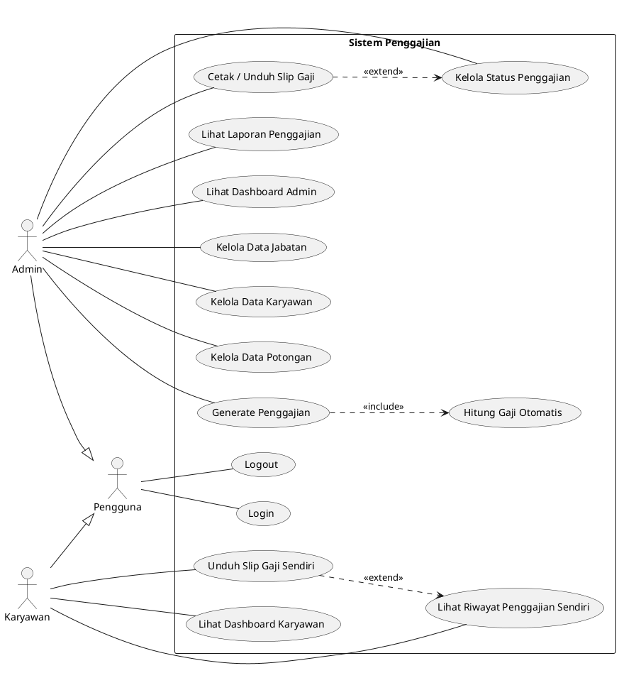
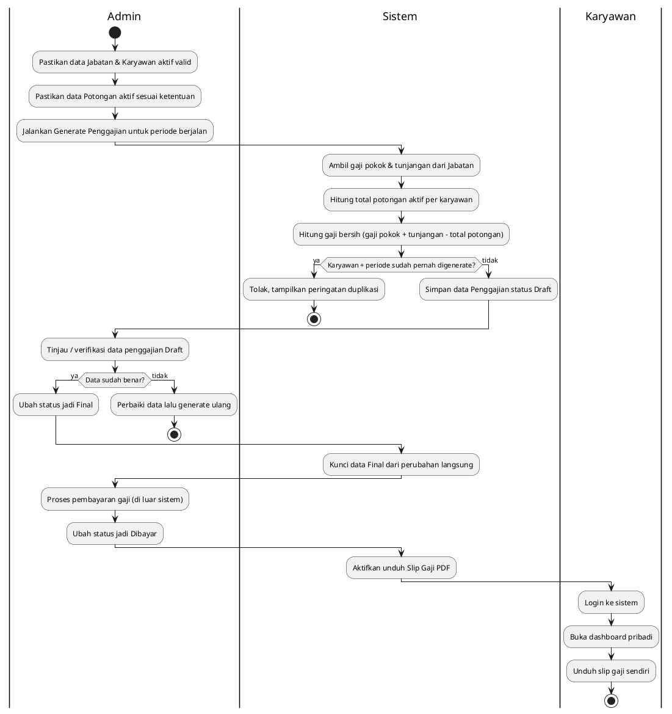
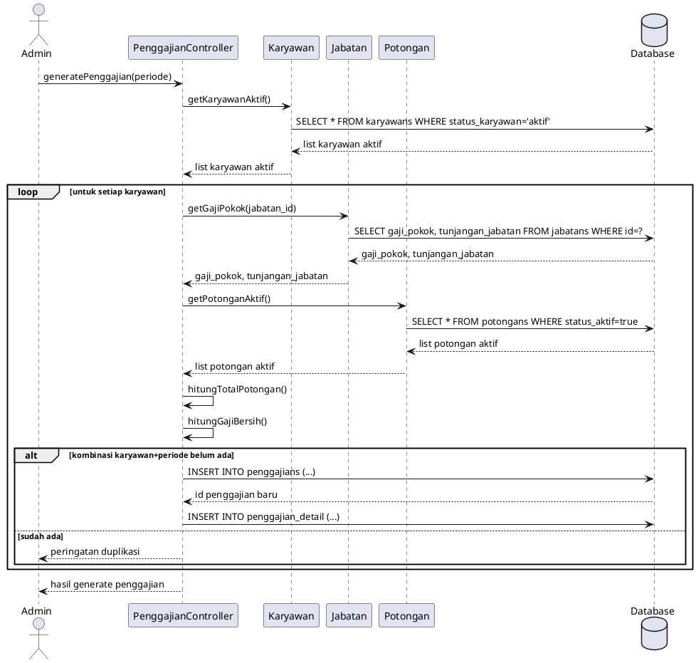
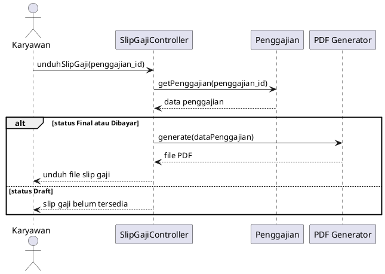
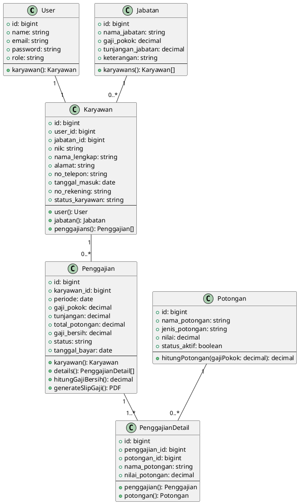
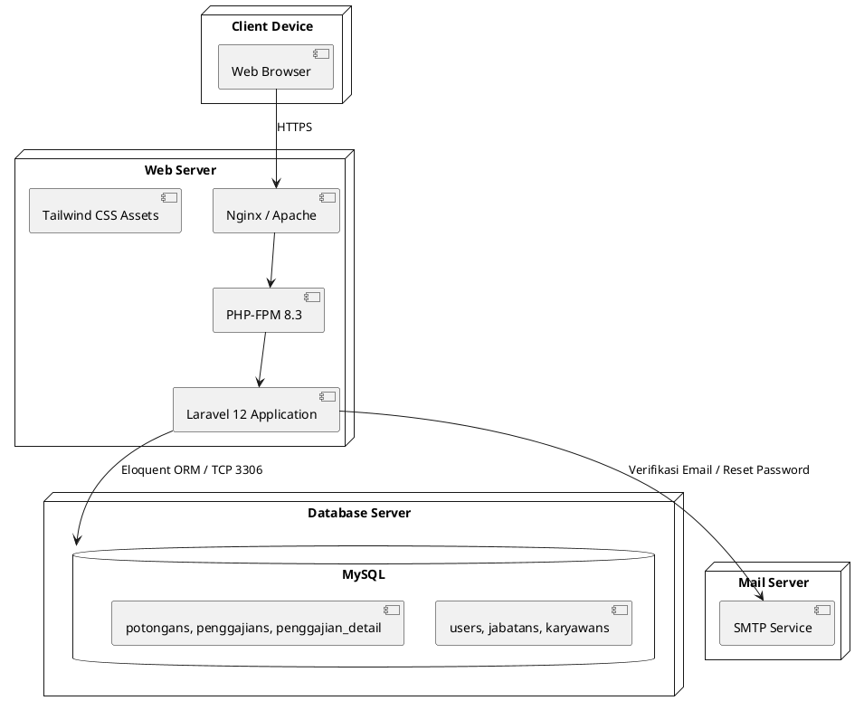

# Diagram UML
## Sistem Informasi Penggajian Berbasis Web

| | |
|---|---|
| **Nama Proyek** | Sistem Penggajian (Payroll Web System) |
| **Versi Dokumen** | 1.0 |
| **Tanggal** | 23 Juli 2026 |
| **Disusun oleh** | Software Architect |
| **Referensi** | PRD v1.0, Analisis Sistem v1.0, Rancangan Database v1.0 |
| **Notasi** | PlantUML |

Seluruh diagram di bawah pakai penamaan aktor, entitas, dan alur yang sama dengan dokumen-dokumen sebelumnya (Admin, Karyawan, jabatans, karyawans, potongans, penggajians, penggajian_detail). Kode bisa langsung dirender lewat plantuml.com/plantuml atau ekstensi PlantUML di VS Code.

---

## Daftar Isi
1. Use Case Diagram
2. Activity Diagram
3. Sequence Diagram
4. Class Diagram
5. Deployment Diagram

---

## 1. Use Case Diagram

## 2. Activity Diagram

Alur proses generate penggajian satu periode, sampai slip gaji diunduh karyawan.

## 3. Sequence Diagram

**3.1 Generate Penggajian**

**3.2 Unduh Slip Gaji**

## 4. Class Diagram

## 5. Deployment Diagram

